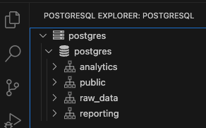
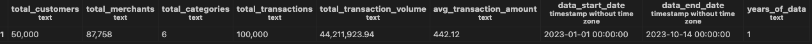

<!DOCTYPE html>
<html>
<head>
   <meta charset="UTF-8">
</head>
<body>

<h1>💳 Credit Card Transaction Analysis - SQL Portfolio</h1>

<!-- ======================= INDEX ======================= -->
<h2>📋 Table of Contents</h2>
<ol>
   <li><a href="#introduction">🎯 Introduction</a></li>
   <li><a href="#technical-setup">🛠️ Technical Setup</a></li>
   <li><a href="#business-insights">📊 Basic Data Exploration - Key Business Insights</a></li>
</ol>

<!-- ======================= INTRODUCTION SECTION ======================= -->
<section id="introduction">
<h2>🎯 Introduction</h2>

<h3>Project Overview</h3>

This repository demonstrates comprehensive SQL skills through analysis of credit card transaction data. The project showcases database design, complex queries, and business intelligence capabilities using PostgreSQL.

<h3>📊 Dataset</h3>

<strong>Source:</strong> <a href="https://www.kaggle.com/datasets/rajatsurana979/comprehensive-credit-card-transactions-dataset">Comprehensive Credit Card Transactions Dataset</a> from Kaggle

<strong>Description:</strong> Real-world financial transaction data including customer demographics, merchant information, transaction details, and fraud indicators.

<strong>Dataset Specifications:</strong>

<ul>
<li><strong>Format:</strong> CSV files with 100,000 transaction records</li>
<li><strong>Time Span:</strong> 10 months (January 1 - October 14, 2023)</li>
<li><strong>Volume:</strong> $44.2M total transaction volume across 50K customers</li>
<li><strong>Scope:</strong> 87,758 active merchants across 6 product categories</li>
</ul>

</section>

<!-- ======================= TECHNICAL SETUP SECTION ======================= -->
<section id="technical-setup">
<h2>🛠️ Technical Setup</h2>

<h3>🏗️ Database Creation from Scratch</h3>

<h4>📋 Initial Planning &amp; Architecture</h4>

<strong>Business Requirements Analysis:</strong> Designed a comprehensive database to support credit card transaction analysis with focus on customer behavior, merchant performance, and fraud detection capabilities.

<strong>Database Architecture Decisions:</strong>

<ul>
<li><strong>Database Engine:</strong> PostgreSQL 15+ selected for enterprise-grade reliability and advanced SQL features</li>
<li><strong>Schema Strategy:</strong> Three-tier architecture for logical data separation</li>
<li><strong>Normalization Level:</strong> 3NF (Third Normal Form) for optimal performance and data integrity</li>
</ul>

<h4>🔨 Database Implementation Process</h4>

<h5>Database &amp; Schema Creation</h5>
<pre><code>-- Created from scratch using PostgreSQL DDL
CREATE DATABASE credit_card_analysis;

-- Implemented three-tier schema architecture
CREATE SCHEMA raw_data;      -- Source data and staging
CREATE SCHEMA analytics;     -- Processed analytical data  
CREATE SCHEMA reporting;     -- Dashboard-ready summaries
</code></pre>

 

<h4>⚙️ Technical Challenges Solved</h4>

<h5>Data Import Complexity</h5>
<blockquote>

<strong>Challenge:</strong> Single denormalized CSV (100K records) needed transformation into normalized relational structure 
<strong>Solution:</strong> Implemented staging table strategy with multi-step ETL process

</blockquote>

<h5>PostgreSQL-Specific Issues Resolved</h5>
<ul>
<li><strong>Date Format Conversion:</strong> CSV dates (DD-MM-YYYY) → PostgreSQL standard (YYYY-MM-DD)</li>
<li><strong>Transaction Isolation:</strong> Database creation commands cannot run in transaction blocks</li>
<li><strong>Number Formatting:</strong> Large numbers requiring custom <code>TO_CHAR</code> patterns with thousands separators</li>
<li><strong>Data Type Casting:</strong> <code>::numeric</code> casting for ROUND() function compatibility</li>
</ul>

<h5>ETL Pipeline Architecture</h5>
<pre><code>Raw CSV → Staging Table → Validation → Entity Extraction → Normalized Tables → Integrity Checks
</code></pre>

<h4>🎯 Performance &amp; Integrity Implementation</h4>

<h5>Strategic Indexing</h5>

Created 7 optimized indexes based on expected query patterns:

<ul>
<li>Transaction dates for temporal analysis</li>
<li>Foreign keys for join optimization</li>
<li>Amount ranges for statistical queries</li>
</ul>

<h5>Data Integrity Enforcement</h5>
<ul>
<li><strong>Referential Integrity:</strong> Complete foreign key constraint implementation</li>
<li><strong>Business Rules:</strong> Check constraints (positive amounts, valid state codes)</li>
<li><strong>Data Quality:</strong> NOT NULL constraints on critical fields</li>
<li><strong>Unique Constraints:</strong> Category name uniqueness</li>
</ul>

<h3>🛠️ Technology Stack &amp; Implementation</h3>

<h4>💾 Database Infrastructure</h4>
<ul>
<li><strong>Database Engine:</strong> PostgreSQL 15+ (Enterprise-grade RDBMS)</li>
<li><strong>Database Management:</strong> pgAdmin 4 (Professional GUI interface)</li>
<li><strong>Schema Design:</strong> Multi-schema architecture (<code>raw_data</code>, <code>analytics</code>, <code>reporting</code>)</li>
<li><strong>Data Types:</strong> Advanced PostgreSQL types (BIGSERIAL, DECIMAL, TIMESTAMP)</li>
</ul>

<h4>🔧 Development Environment</h4>
<ul>
<li><strong>Code Editor:</strong> Visual Studio Code 2</li>
<li><strong>SQL Extensions:</strong>
<ul>
<li>PostgreSQL Extension (Chris Kolkman)</li>
<li>SQLTools with PostgreSQL Driver</li>
</ul>
</li>
<li><strong>Connection Strategy:</strong> Configured persistent database connections with proper authentication</li>
<li><strong>Terminal Integration:</strong> VS Code integrated terminal for PostgreSQL CLI operations</li>
</ul>

<h4>📊 Data Engineering Pipeline</h4>

<h5>ETL Process Implementation</h5>
<table>
<thead>
<tr>
<th>Phase</th>
<th>Technology</th>
<th>Implementation</th>
</tr>
</thead>
<tbody>
<tr>
<td><strong>Extract</strong></td>
<td>PostgreSQL COPY</td>
<td>Bulk CSV import with error handling</td>
</tr>
<tr>
<td><strong>Transform</strong></td>
<td>Advanced SQL</td>
<td>Data type conversions, relationship mapping</td>
</tr>
<tr>
<td><strong>Load</strong></td>
<td>Multi-table INSERT</td>
<td>Normalized data distribution with referential integrity</td>
</tr>
<tr>
<td><strong>Validate</strong></td>
<td>SQL Constraints</td>
<td>Data quality checks and relationship verification</td>
</tr>
</tbody>
</table>

<h4>📈 Advanced SQL Analytics Implementation</h4>

<h5>Query Complexity Levels Demonstrated</h5>
<ul>
<li><strong>Basic Aggregations:</strong> COUNT, SUM, AVG, MIN, MAX with business context</li>
<li><strong>Statistical Functions:</strong> PERCENTILE_CONT, STDDEV for distribution analysis</li>
<li><strong>Advanced Joins:</strong> Multi-table relationships with complex business logic</li>
<li><strong>Window Functions:</strong> ROW_NUMBER, RANK, LAG for analytical rankings</li>
<li><strong>Common Table Expressions (CTEs):</strong> Complex multi-step analytical workflows</li>
</ul>

<h5>Professional Data Presentation</h5>
<ul>
<li><strong>Number Formatting:</strong> <code>TO_CHAR</code> with thousands separators (999,999,999)</li>
<li><strong>Percentage Calculations:</strong> Precise business ratio computations with proper rounding</li>
<li><strong>Date Manipulations:</strong> <code>DATE_TRUNC</code>, <code>EXTRACT</code> for temporal analysis</li>
<li><strong>Text Processing:</strong> <code>COALESCE</code>, <code>CASE</code> statements for data cleaning</li>
</ul>

<h4>🚀 Production-Ready Features</h4>

<h5>Scalability &amp; Performance</h5>
<ul>
<li><strong>Future-Proof Keys:</strong> BIGSERIAL for high-volume transaction growth</li>
<li><strong>Efficient Indexing:</strong> Strategic indexes for query performance optimization</li>
<li><strong>Modular Architecture:</strong> Extensible schema design for additional data sources</li>
</ul>

<h5>Enterprise Standards</h5>
<ul>
<li><strong>Code Documentation:</strong> Comprehensive inline comments explaining business logic</li>
<li><strong>Naming Conventions:</strong> Consistent, descriptive column and table names</li>
<li><strong>Error Handling:</strong> Robust CSV import with data type validation</li>
<li><strong>Professional Presentation:</strong> Formatted output with business-ready metrics</li>
</ul>

<h4>🔄 Version Control &amp; Documentation</h4>
<ul>
<li><strong>Repository Management:</strong> Git/GitHub with structured SQL file organization</li>
<li><strong>Documentation Strategy:</strong> Comprehensive README with technical and business insights</li>
<li><strong>Code Organization:</strong> Logical progression from basic to advanced analytics</li>
<li><strong>Professional Standards:</strong> Industry-standard commenting and formatting</li>
</ul>

<blockquote>

<strong>🎯 Technical Achievement:</strong> This project demonstrates complete database lifecycle management from conceptual design through production implementation, showcasing enterprise-level PostgreSQL database creation, ETL pipeline development, advanced SQL analytics, and professional documentation standards - all built from scratch using industry best practices.

</blockquote>

</section>

<!-- ======================= BUSINESS INSIGHTS SECTION ======================= -->
<section id="business-insights">
<h2>📊 Basic Data Exploration - Key Business Insights</h2>

<h3>🔍 Dataset Overview</h3>

Our comprehensive analysis of credit card transaction data reveals a robust dataset spanning <strong>10 months of 2023</strong> (January 1 - October 14) with significant business intelligence analysis opportunities.

<strong>Core Metrics:</strong>

<ul>
<li><strong>Total Transaction Volume:</strong> $44,211,923.94</li>
<li><strong>Total Transactions:</strong> 100,000</li>
<li><strong>Unique Customers:</strong> 50,000</li>
<li><strong>Active Merchants:</strong> 87,758</li>
<li><strong>Product Categories:</strong> 6</li>
<li><strong>Average Transaction:</strong> $442.12</li>
</ul>

 

<h3>💰 Transaction Distribution Analysis</h3>

<strong>Statistical Profile:</strong>

<ul>
<li><strong>Median Transaction:</strong> $182.20</li>
<li><strong>75th Percentile:</strong> $470.52</li>
<li><strong>Transaction Range:</strong> $5.01 - $2,999.88</li>
<li><strong>Distribution:</strong> Right-skewed (median significantly below mean)</li>
</ul>

<strong>Key Insight:</strong> The wide gap between median ($182.20) and mean ($442.12) indicates a mix of routine purchases and high-value transactions, suggesting diverse customer spending behaviors.

<em>[📸 Screenshot Placeholder: Transaction Amount Distribution]</em>

<h3>🎯 Category Performance Analysis</h3>

<strong>Transaction Count Distribution:</strong> 
All 6 categories show remarkably even distribution (~16% each):

<ul>
<li>Travel, Electronics, Market, Clothing, Cosmetics, Restaurant</li>
</ul>

<strong>Revenue Concentration (Disproportionate):</strong>

<ul>
<li><strong>Travel:</strong> 58.36% ($25,800,463.88) - <em>Dominant revenue driver</em></li>
<li><strong>Electronics:</strong> 19.88% ($8,788,184.20) - <em>Secondary contributor</em></li>
<li><strong>Other 4 Categories:</strong> Combined ~22% - <em>Significant underperformance</em></li>
</ul>

<strong>🚨 Strategic Implication:</strong> Travel transactions have much higher average values, representing a premium customer segment.

<em>[📸 Screenshot Placeholder: Category Performance Table]</em>

<h3>📅 Temporal Pattern Analysis</h3>

<h4>Weekly Distribution</h4>

<strong>Consistent Behavior:</strong> Transaction volume evenly distributed across all days (~14% per day)

<ul>
<li><strong>No weekend/weekday bias</strong> - suggests B2B and B2C mix</li>
<li><strong>Operational stability</strong> - predictable daily volume for capacity planning</li>
</ul>

<h4>Monthly Trends</h4>

<strong>Stable Performance:</strong> Average transaction amount consistent at ~$400/month (Jan-Sep)

<ul>
<li><strong>October Anomaly:</strong> ~50% volume drop (partial month - data ends Oct 14)</li>
<li><strong>Forecasting Reliability:</strong> Consistent monthly patterns enable accurate projections</li>
</ul>

<em>[📸 Screenshot Placeholder: Weekly and Monthly Patterns]</em>

<h3>👥 Customer Behavior Insights</h3>

<h4>High-Value Customer Analysis</h4>

<strong>Top 20 Customers Identified</strong> with detailed spending profiles including:

<ul>
<li>Transaction frequency patterns</li>
<li>Customer lifetime spans</li>
<li>Geographic distribution</li>
<li>Spending consistency</li>
</ul>

<h4>Geographic Distribution</h4>

Analysis reveals customer concentration patterns across states, enabling targeted regional strategies.

<em>[📸 Screenshot Placeholder: Top Customers Table]</em>

<h3>🏪 Merchant Performance &amp; Market Structure</h3>

<h4>Market Concentration</h4>

<strong>Critical Finding:</strong> Top 2 merchants control ≥20% of total transaction volume

<ul>
<li><strong>Johnson PLC</strong> leads merchant performance</li>
<li><strong>High market concentration risk</strong> - dependency on few key partners</li>
</ul>

<h4>Industry Dominance</h4>

<strong>Travel Category Monopoly:</strong> All top 15 merchants operate in travel sector

<ul>
<li><strong>Sector concentration risk</strong></li>
<li><strong>Limited category diversification</strong> in top performers</li>
</ul>

<h4>Customer Diversification Health</h4>

<strong>Positive Indicator:</strong> All top 15 merchants achieve ~50% customer diversity ratio

<ul>
<li><strong>Strong customer acquisition</strong> across merchants</li>
<li><strong>Healthy competitive landscape</strong> beyond top 2 players</li>
</ul>

<em>[📸 Screenshot Placeholder: Merchant Performance Analysis]</em>

<h3>🎯 Strategic Business Implications</h3>

<h4>💼 Key Opportunities</h4>
<ol>
<li><strong>Premium Category Strategy:</strong> Investigate travel's high-value model for replication</li>
<li><strong>Electronics Growth:</strong> 2nd largest category with expansion potential (currently 19.88%)</li>
<li><strong>Customer Loyalty:</strong> 50% diversity suggests room for retention programs</li>
</ol>

<h4>⚠️ Risk Management Priorities</h4>
<ol>
<li><strong>Revenue Concentration:</strong> 58% dependency on travel category</li>
<li><strong>Merchant Dependency:</strong> Top 2 merchants control &gt;20% volume</li>
<li><strong>Seasonal Patterns:</strong> Monitor Q4 performance (data gap Nov-Dec)</li>
</ol>

<h4>📈 Forecasting Insights</h4>
<ul>
<li><strong>Predictable Daily Volume:</strong> ~14% distribution enables capacity planning</li>
<li><strong>Stable Monthly Performance:</strong> $400 average supports budgeting</li>
<li><strong>Category Stability:</strong> Consistent ratios enable category-specific strategies</li>
</ul>

<h3>🔧 Technical Implementation Notes</h3>

<strong>Data Quality:</strong> High-quality dataset with consistent formatting and complete transaction records through October 14, 2023.

<strong>SQL Complexity Demonstrated:</strong>

<ul>
<li>Advanced aggregations and statistical functions</li>
<li>Multi-table joins with proper relationships</li>
<li>Window functions for ranking and percentiles</li>
<li>Complex percentage calculations with proper formatting</li>
</ul>

<em>[📸 Screenshot Placeholder: Technical Query Examples]</em>

<blockquote>

<strong>Analysis Methodology:</strong> This comprehensive exploration utilized advanced SQL techniques including CTEs, window functions, statistical aggregations, and multi-dimensional grouping to extract actionable business intelligence from raw transaction data.

</blockquote>

</section>

</body>
</html>
