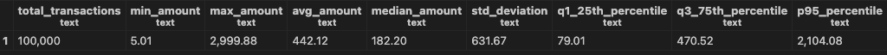
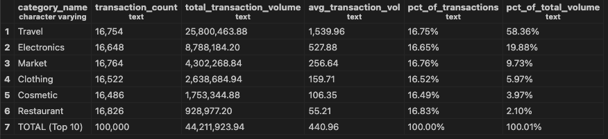
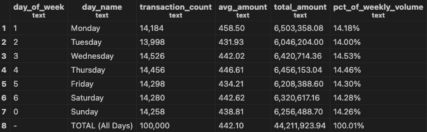
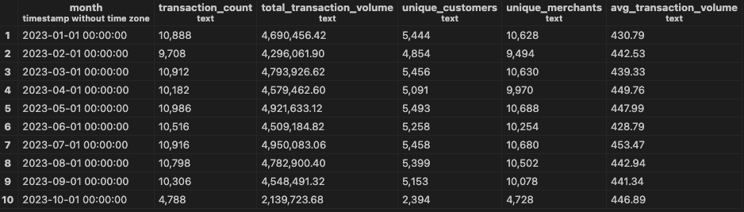
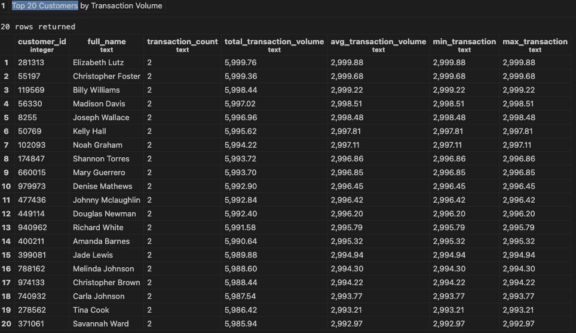
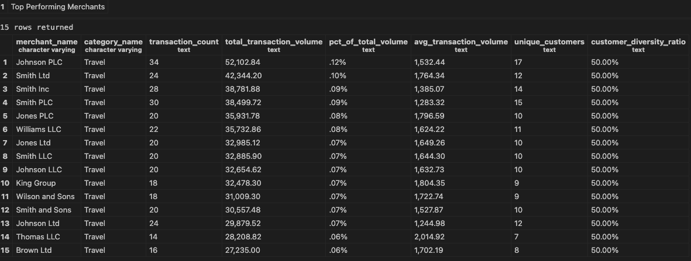
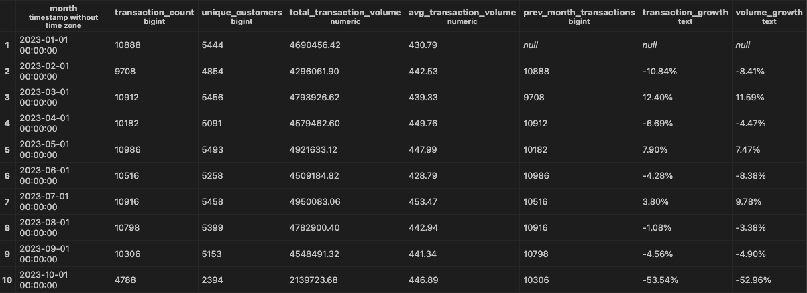
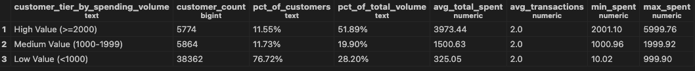
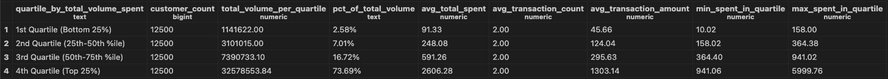
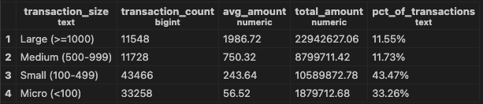

<!DOCTYPE html>

  <h1>Guillermo Ibanez | SQL Portfolio</h1>
  <h1><h1>

<html>
<head>
   <meta charset="UTF-8">
</head>
<body>

<h1>💳 Credit Card Transactions Analysis</h1>

<!-- ======================= INDEX ======================= -->
<h2>📋 Table of Contents</h2>
<ol>
   <li><a href="#introduction">🎯 Introduction</a></li>
   <li><a href="#technical-setup">🛠️ Technical Setup</a></li>
   <li><a href="#technical-SQL-skills">🛠️ Technical SQL Skills</a></li>
   <li><a href="#business-insights">📊 Data Exploration - Key Business Insights</a></li>
   <li><a href="#advanced-analytics">📈 Advanced SQL Analytics - Key Business Intelligence Insights</a></li>
</ol>

<!-- ======================= INTRODUCTION SECTION ======================= -->
<section id="introduction">
<h2>🎯 Introduction</h2>

<h3>Project Overview</h3>

This repository demonstrates comprehensive SQL skills through analysis of credit card transaction data. The project showcases database design, complex queries, and business intelligence capabilities using PostgreSQL.

<h3>📊 Dataset</h3>

<strong>Source:</strong> <a href="https://www.kaggle.com/datasets/rajatsurana979/comprehensive-credit-card-transactions-dataset">Comprehensive Credit Card Transactions Dataset</a> from Kaggle

<strong>Description:</strong> Real-world financial transaction data including customer demographics, merchant information, transaction details, and fraud indicators.

<strong>Dataset Specifications:</strong>

<ul>
<li><strong>Format:</strong> CSV files with 100,000 transaction records</li>
<li><strong>Time Span:</strong> 10 months (January 1 - October 14, 2023)</li>
<li><strong>Volume:</strong> $44.2M total transaction volume across 50K customers</li>
<li><strong>Scope:</strong> 87,758 active merchants across 6 product categories</li>
</ul>

</section>

<!-- ======================= TECHNICAL SETUP SECTION ======================= -->
<section id="technical-setup">
<h2>🛠️ Technical Setup</h2>

<h3>🏗️ Database Creation from Scratch</h3>

<h4>📋 Initial Planning &amp; Architecture</h4>

<strong>Business Requirements Analysis:</strong> Designed a comprehensive database to support credit card transaction analysis with focus on customer behavior, merchant performance, and fraud detection capabilities.

<strong>Database Architecture Decisions:</strong>

<ul>
<li><strong>Database Engine:</strong> PostgreSQL 15+ selected for enterprise-grade reliability and advanced SQL features</li>
<li><strong>Schema Strategy:</strong> Three-tier architecture for logical data separation</li>
<li><strong>Normalization Level:</strong> 3NF (Third Normal Form) for optimal performance and data integrity</li>
</ul>

<h4>🔨 Database Implementation Process</h4>

<h5>Database &amp; Schema Creation</h5>
<pre><code>-- Created from scratch using PostgreSQL DDL
CREATE DATABASE credit_card_analysis;

-- Implemented three-tier schema architecture
CREATE SCHEMA raw_data;      -- Source data and staging
CREATE SCHEMA analytics;     -- Processed analytical data  
CREATE SCHEMA reporting;     -- Dashboard-ready summaries
</code></pre>

 

<h4>⚙️ Technical Challenges Solved</h4>

<h5>Data Import Complexity</h5>
<blockquote>

<strong>Challenge:</strong> Single denormalized CSV (100K records) needed transformation into normalized relational structure 
<strong>Solution:</strong> Implemented staging table strategy with multi-step ETL process

</blockquote>

<h5>PostgreSQL-Specific Issues Resolved</h5>
<ul>
<li><strong>Date Format Conversion:</strong> CSV dates (DD-MM-YYYY) → PostgreSQL standard (YYYY-MM-DD)</li>
<li><strong>Transaction Isolation:</strong> Database creation commands cannot run in transaction blocks</li>
<li><strong>Number Formatting:</strong> Large numbers requiring custom <code>TO_CHAR</code> patterns with thousands separators</li>
<li><strong>Data Type Casting:</strong> <code>::numeric</code> casting for ROUND() function compatibility</li>
</ul>

<h5>ETL Pipeline Architecture</h5>
<pre><code>Raw CSV → Staging Table → Validation → Entity Extraction → Normalized Tables → Integrity Checks
</code></pre>

<h4>🎯 Performance &amp; Integrity Implementation</h4>

<h5>Strategic Indexing</h5>

Created 7 optimized indexes based on expected query patterns:

<ul>
<li>Transaction dates for temporal analysis</li>
<li>Foreign keys for join optimization</li>
<li>Amount ranges for statistical queries</li>
</ul>

<h5>Data Integrity Enforcement</h5>
<ul>
<li><strong>Referential Integrity:</strong> Complete foreign key constraint implementation</li>
<li><strong>Business Rules:</strong> Check constraints (positive amounts, valid state codes)</li>
<li><strong>Data Quality:</strong> NOT NULL constraints on critical fields</li>
<li><strong>Unique Constraints:</strong> Category name uniqueness</li>
</ul>

<!-- ======================= Technical SQL Skills ======================= -->
<section id="technical-SQL-skills">
<h2>🛠️ Technical SQL Skills</h2>

<h3>💾 Database Infrastructure & Architecture</h3>

<h4>Core Technology Stack</h4>
<ul>
<li><strong>Database Engine:</strong> PostgreSQL 15+ (Enterprise-grade RDBMS)</li>
<li><strong>Database Management:</strong> pgAdmin 4 (Professional GUI interface)</li>
<li><strong>Schema Design:</strong> Multi-schema architecture (<code>raw_data</code>, <code>analytics</code>, <code>reporting</code>)</li>
<li><strong>Data Types:</strong> Advanced PostgreSQL types (BIGSERIAL, DECIMAL, TIMESTAMP)</li>
</ul>

<h4>Development Environment</h4>
<ul>
<li><strong>Code Editor:</strong> Visual Studio Code 2</li>
<li><strong>SQL Extensions:</strong>
<ul>
<li>PostgreSQL Extension (Chris Kolkman)</li>
<li>SQLTools with PostgreSQL Driver</li>
</ul>
</li>
<li><strong>Connection Strategy:</strong> Configured persistent database connections with proper authentication</li>
<li><strong>Terminal Integration:</strong> VS Code integrated terminal for PostgreSQL CLI operations</li>
</ul>

<h3>📊 Advanced SQL Analytics Implementation</h3>

<h4>Comprehensive SQL Proficiency Demonstrated</h4>

<h5>Foundation & Intermediate Techniques</h5>
<ul>
<li><strong>Advanced Aggregations:</strong> COUNT, SUM, AVG, MIN, MAX with sophisticated business context</li>
<li><strong>Statistical Functions:</strong> PERCENTILE_CONT, STDDEV for distribution analysis</li>
<li><strong>Complex Joins:</strong> Multi-table relationships with intricate business logic</li>
<li><strong>Data Quality Management:</strong> High-quality dataset processing with consistent formatting</li>
<li><strong>Professional Formatting:</strong> Complex percentage calculations with proper rounding and presentation</li>
</ul>

<h5>Advanced & Expert-Level Techniques</h5>
<ul>
<li><strong>Window Functions:</strong> 
<ul>
<li>LAG() for sophisticated period-over-period growth analysis</li>
<li>ROW_NUMBER, RANK for analytical rankings and comparisons</li>
<li>NTILE() for statistical quartile customer segmentation</li>
</ul>
</li>
<li><strong>Common Table Expressions (CTEs):</strong> Complex multi-step analytical workflows and recursive queries</li>
<li><strong>Statistical Segmentation:</strong> Advanced customer tier classification and distribution analysis</li>
<li><strong>Business Logic Implementation:</strong> Sophisticated CASE statements for dynamic tier classification</li>
<li><strong>Performance Optimization:</strong> Efficient query structures designed for large-scale datasets</li>
</ul>

<h4>Professional Data Engineering Standards</h4>

<h5>ETL Process Implementation</h5>
<table>
<thead>
<tr>
<th>Phase</th>
<th>Technology</th>
<th>Implementation</th>
<th>Advanced Features</th>
</tr>
</thead>
<tbody>
<tr>
<td><strong>Extract</strong></td>
<td>PostgreSQL COPY</td>
<td>Bulk CSV import with error handling</td>
<td>Data type validation & integrity checks</td>
</tr>
<tr>
<td><strong>Transform</strong></td>
<td>Advanced SQL</td>
<td>Data type conversions, relationship mapping</td>
<td>Complex business logic transformations</td>
</tr>
<tr>
<td><strong>Load</strong></td>
<td>Multi-table INSERT</td>
<td>Normalized data distribution with referential integrity</td>
<td>Performance-optimized batch processing</td>
</tr>
<tr>
<td><strong>Validate</strong></td>
<td>SQL Constraints</td>
<td>Data quality checks and relationship verification</td>
<td>Statistical validation & anomaly detection</td>
</tr>
</tbody>
</table>

<h5>Enterprise-Grade Data Presentation</h5>
<ul>
<li><strong>Number Formatting:</strong> <code>TO_CHAR</code> with thousands separators (999,999,999) for business readiness</li>
<li><strong>Temporal Analysis:</strong> <code>DATE_TRUNC</code>, <code>EXTRACT</code> for sophisticated time-series analysis</li>
<li><strong>Text Processing:</strong> <code>COALESCE</code>, advanced <code>CASE</code> statements for comprehensive data cleaning</li>
<li><strong>Multi-dimensional Grouping:</strong> Complex GROUP BY operations with ROLLUP and analytical hierarchies</li>
</ul>

<h3>🚀 Production-Ready Architecture & Standards</h3>

<h4>Scalability & Performance Engineering</h4>
<ul>
<li><strong>Future-Proof Design:</strong> BIGSERIAL keys for high-volume transaction growth and enterprise scalability</li>
<li><strong>Strategic Indexing:</strong> Performance-optimized indexes for complex analytical query acceleration</li>
<li><strong>Modular Architecture:</strong> Extensible schema design enabling seamless integration of additional data sources</li>
<li><strong>Query Optimization:</strong> Efficient execution plans for large-scale data processing</li>
</ul>

<h4>Enterprise Development Standards</h4>
<ul>
<li><strong>Comprehensive Documentation:</strong> Detailed inline comments explaining complex business logic and analytical methodologies</li>
<li><strong>Naming Conventions:</strong> Consistent, descriptive naming standards following industry best practices</li>
<li><strong>Error Handling:</strong> Robust data import processes with comprehensive validation and exception management</li>
<li><strong>Version Control:</strong> Git/GitHub integration with structured SQL file organization and professional documentation</li>
</ul>

<h3>📈 Advanced Analytics Methodology</h3>

<h4>Technical Analysis Approach</h4>

<strong>Sophisticated Analytical Framework:</strong> This project demonstrates a comprehensive progression from foundational SQL operations through advanced statistical analysis, showcasing:

<ul>
<li><strong>Multi-layered Analysis:</strong> Basic exploration → Intermediate aggregations → Advanced statistical modeling</li>
<li><strong>Business Intelligence Integration:</strong> Technical SQL proficiency combined with strategic business insight generation</li>
<li><strong>Statistical Rigor:</strong> Enterprise-level analytical methodologies including quartile analysis, growth modeling, and customer segmentation</li>
<li><strong>Production Readiness:</strong> Code quality and documentation standards suitable for enterprise deployment</li>
</ul>

<blockquote>

<strong>🎯 Technical Achievement:</strong> This project demonstrates complete database lifecycle mastery from conceptual design through advanced analytics implementation. The work showcases enterprise-level PostgreSQL database creation, sophisticated ETL pipeline development, expert-level SQL analytics (including window functions, CTEs, and statistical modeling), and professional documentation standards - all built from scratch using industry best practices and demonstrating both technical SQL mastery and strategic business intelligence capabilities.

</blockquote>

<blockquote>

<strong>Advanced Analytics Methodology:</strong> The analytical approach leverages enterprise-grade SQL techniques including advanced window functions, statistical segmentation, growth trend analysis, and multi-dimensional customer modeling to transform raw transactional data into actionable business intelligence, demonstrating both deep technical proficiency and strategic analytical thinking.

</blockquote>

</section>

<!-- ======================= TECHNICAL SETUP SECTION ======================= -->
<!-- [Keep all your existing technical setup content here - it's perfect as is] -->

<!-- ======================= BUSINESS INSIGHTS SECTION ======================= -->
<!-- [Keep all your existing business insights content here] -->

<!-- ======================= BUSINESS INSIGHTS SECTION ======================= -->
<section id="business-insights">
<h2>📊 Data Exploration - Key Business Insights</h2>

<h3>🔍 Dataset Overview</h3>

Our comprehensive analysis of credit card transaction data reveals a robust dataset spanning <strong>10 months of 2023</strong> (January 1 - October 14) with significant business intelligence analysis opportunities.

<strong>Core Metrics:</strong>

<ul>
<li><strong>Total Transaction Volume:</strong> $44,211,923.94</li>
<li><strong>Total Transactions:</strong> 100,000</li>
<li><strong>Unique Customers:</strong> 50,000</li>
<li><strong>Active Merchants:</strong> 87,758</li>
<li><strong>Product Categories:</strong> 6</li>
<li><strong>Average Transaction:</strong> $442.12</li>
</ul>

 

<h3>💰 Transaction Distribution Analysis</h3>

<strong>Statistical Profile:</strong>

<ul>
<li><strong>Median Transaction:</strong> $182.20</li>
<li><strong>75th Percentile:</strong> $470.52</li>
<li><strong>Transaction Range:</strong> $5.01 - $2,999.88</li>
<li><strong>Distribution:</strong> Right-skewed (median significantly below mean)</li>
</ul>

<strong>Key Insight:</strong> The wide gap between median ($182.20) and mean ($442.12) indicates a mix of routine purchases and high-value transactions, suggesting diverse customer spending behaviors.

 

<h3>🎯 Category Performance Analysis</h3>

<strong>Transaction Count Distribution:</strong> 
All 6 categories show remarkably even distribution (~16% each):

<ul>
<li>Travel, Electronics, Market, Clothing, Cosmetics, Restaurant</li>
</ul>

<strong>Revenue Concentration (Disproportionate):</strong>

<ul>
<li><strong>Travel:</strong> 58.36% ($25,800,463.88) - <em>Dominant revenue driver</em></li>
<li><strong>Electronics:</strong> 19.88% ($8,788,184.20) - <em>Secondary contributor</em></li>
<li><strong>Other 4 Categories:</strong> Combined ~22% - <em>Significant underperformance</em></li>
</ul>

<strong>🚨 Strategic Implication:</strong> Travel transactions have much higher transaction volumes, representing a key customer segment for the company in terms of volume and potentially profitability although we cannot confirm this last point as there is not data on revenues per transaction nor profitability in general.

 

<h3>📅 Temporal Pattern Analysis</h3>

<h4>Weekly Distribution</h4>

<strong>Consistent Behavior:</strong> Transaction volume evenly distributed across all days (~14% per day)

<ul>
<li><strong>No weekend/weekday bias</strong> - suggests B2B and B2C mix</li>
<li><strong>Operational stability</strong> - predictable daily volume for capacity planning</li>
</ul>

 

<h4>Monthly Trends</h4>

<strong>Stable Performance:</strong> Average transaction amount consistent at ~$400/month (Jan-Sep)

<ul>
<li><strong>October Anomaly:</strong> ~50% volume drop (partial month - data ends Oct 14)</li>
<li><strong>Forecasting Reliability:</strong> Consistent monthly patterns enable accurate projections</li>
</ul>

 

<h3>👥 Customer Behavior Insights</h3>

<h4>High-Value Customer Analysis</h4>

<strong>Top 20 Customers Identified</strong> with detailed spending profiles including:

 

<h3>🏪 Merchant Performance &amp; Market Structure</h3>

<h4>Market Concentration</h4>

<strong>Critical Finding:</strong> Top 2 merchants control ≥20% of total transaction volume

<ul>
<li><strong>Johnson PLC</strong> leads merchant performance</li>
<li><strong>High market concentration risk</strong> - dependency on few key partners</li>
</ul>

<h4>Industry Dominance</h4>

<strong>Travel Category Monopoly:</strong> All top 15 merchants operate in travel sector

<ul>
<li><strong>Sector concentration risk</strong></li>
<li><strong>Limited category diversification</strong> in top merchant partners</li>
</ul>

<h4>Customer Diversification Health</h4>

<strong>Positive Indicator:</strong> All top 15 merchants achieve ~50% customer diversity ratio

<ul>
<li><strong>Strong customer acquisition</strong> across merchants</li>
<li><strong>Healthy competitive landscape</strong> beyond top 2 players</li>
</ul>

 

<h3>🎯 Strategic Business Implications</h3>

<h4>💼 Key Opportunities</h4>
<ol>
<li><strong>Premium Category Strategy:</strong> Investigate travel's high-value model for replication (currently 58.36% of total transaction volume)</li>
<li><strong>Electronics Growth:</strong> 2nd largest category with expansion potential (currently 19.88% of total transaction volume)</li>
<li><strong>Customer Loyalty:</strong> 50% diversity suggests room for retention programs</li>
</ol>

<h4>⚠️ Risk Management Priorities</h4>
<ol>
<li><strong>Revenue Concentration:</strong> 58% dependency on travel category</li>
<li><strong>Merchant Dependency:</strong> Top 2 merchants control &gt;20% volume</li>
<li><strong>Seasonal Patterns:</strong> Difficult to monitor or take actionable conclusions with missing data from November and December</li>
</ol>

<h4>📈 Forecasting Insights</h4>
<ul>
<li><strong>Predictable Daily Volume:</strong> ~14% distribution enables capacity planning</li>
<li><strong>Stable Monthly Performance:</strong> $400 average supports budgeting (although this ignores data from December and November which is not available).</li>
<li><strong>Category Stability:</strong> Consistent ratios enable category-specific strategies</li>
</ul>

</section>

</body>
</html>

<!-- ======================= ADVANCED ANALYTICS SECTION ======================= -->
<section id="advanced-analytics">
<h2>📈 Advanced SQL Analytics - Key Business Intelligence Insights</h2>

<h3>🔍 Advanced Analysis Overview</h3>

Building upon the foundational data exploration, this advanced analytics phase employed sophisticated SQL techniques including <strong>window functions</strong>, <strong>Common Table Expressions (CTEs)</strong>, <strong>statistical segmentation</strong>, and <strong>growth analysis</strong> to extract deeper business intelligence from the credit card transaction data.

<strong>Advanced Techniques Demonstrated:</strong>

<ul>
<li><strong>LAG Functions:</strong> Month-over-month growth calculations</li>
<li><strong>NTILE & Percentile Analysis:</strong> Customer quartile segmentation</li>
<li><strong>Customer Lifetime Value Modeling:</strong> Multi-tier customer classification</li>
<li><strong>Statistical Distribution Analysis:</strong> Transaction size categorization</li>
</ul>

<h3>📊 Monthly Growth Pattern Analysis</h3>

<h4>Seasonal Transaction Volatility</h4>

<strong>Key Discovery:</strong> Monthly transaction data reveals a distinctive <strong>alternating growth pattern</strong> with significant seasonal implications for business planning.

<strong>Growth Pattern Timeline:</strong>

<ul>
<li><strong>February:</strong> Notable decline in both transaction count and volume</li>
<li><strong>March:</strong> Strong recovery with ~12% growth in both metrics</li>
<li><strong>April-August:</strong> Consistent alternating pattern between growth and decline months</li>
<li><strong>August-September:</strong> Two consecutive months of decline</li>
</ul>

<h4>Post-Summer Spending Behavior</h4>

<strong>🚨 Critical Insight:</strong> The sustained decline in August and September suggests a <strong>seasonal spending pattern</strong> where customers reduce transaction activity following summer holiday expenditures.

<strong>Business Implications:</strong>

<ul>
<li><strong>Predictable Seasonality:</strong> Alternating growth/decline pattern enables forecasting</li>
<li><strong>Post-Holiday Effect:</strong> Consecutive declines indicate budget recovery periods</li>
<li><strong>Planning Opportunity:</strong> Anticipate lower Q3 performance for resource allocation</li>
</ul>

 

<h3>👥 Advanced Customer Segmentation Intelligence</h3>

<h4>Customer Value Distribution Analysis</h4>

Our sophisticated customer tier analysis reveals significant <strong>market concentration</strong> and <strong>revenue distribution patterns</strong> critical for strategic decision-making.

<h4>Customer Tier Breakdown by Spending Volume</h4>
<table>
<thead>
<tr>
<th>Customer Tier</th>
<th>Spending Criteria</th>
<th>% of Customers</th>
<th>% of Total Volume</th>
<th>Strategic Significance</th>
</tr>
</thead>
<tbody>
<tr>
<td><strong>High Value</strong></td>
<td>≥$2,000</td>
<td>~11.55%</td>
<td><strong>51.89%</strong></td>
<td>Revenue concentration</td>
</tr>
<tr>
<td><strong>Medium Value</strong></td>
<td>$1,000-$1,999</td>
<td>11.73%</td>
<td>19.9%</td>
<td>Growth potential</td>
</tr>
<tr>
<td><strong>Low Value</strong></td>
<td>&lt;$1,000</td>
<td><strong>76.72%</strong></td>
<td>28.2%</td>
<td>Activation opportunity</td>
</tr>
</tbody>
</table>

<h4>🎯 Strategic Customer Intelligence</h4>

<strong>Critical Finding:</strong> Just <strong>11.55% of customers generate 51.89% of total transaction volume</strong> - a textbook demonstration of the Pareto Principle in customer value distribution.

<strong>Business Strategy Implications:</strong>

<ul>
<li><strong>VIP Focus:</strong> High-value segment (11.55%) drives majority of revenue</li>
<li><strong>Untapped Potential:</strong> 76.72% of customers represent activation opportunities</li>
<li><strong>Resource Allocation:</strong> Disproportionate ROI from focusing on top-tier customers</li>
<li><strong>Risk Management:</strong> High revenue dependency on small customer segment</li>
</ul>

 

<h3>📈 Quartile-Based Customer Analysis</h3>

<h4>Statistical Customer Segmentation via NTILE Analysis</h4>

Advanced quartile segmentation using SQL window functions reveals even more pronounced <strong>customer concentration patterns</strong> that exceed traditional tier-based analysis.

<table>
<thead>
<tr>
<th>Metric</th>
<th>Value</th>
<th>Strategic Impact</th>
</tr>
</thead>
<tbody>
<tr>
<td><strong>Top Quartile Customers</strong></td>
<td>25%</td>
<td>Critical customer segment</td>
</tr>
<tr>
<td><strong>Share of Total Transaction Volume</strong></td>
<td><strong>73.69%</strong></td>
<td>Extreme revenue concentration</td>
</tr>
</tbody>
</table>

<h4>🎯 Quartile Distribution Insights</h4>

<strong>🚨 Critical Statistical Finding:</strong> The top 25% quartile of customers accounts for an extraordinary <strong>73.69% of total transaction volume</strong> - demonstrating extreme revenue concentration that surpasses even the Pareto Principle expectations.

<strong>Quartile Analysis Implications:</strong>

<ul>
<li><strong>Ultra-High Concentration:</strong> Top quartile generates nearly 3/4 of all transactions volume</li>
<li><strong>Risk Amplification:</strong> Business vulnerability concentrated in just 25% of customer base</li>
<li><strong>Resource Priority:</strong> Quartile-based segmentation reveals even stronger case for VIP customer focus</li>
<li><strong>Growth Strategy:</strong> Moving customers from lower quartiles to top quartile has massive revenue impact</li>
<li><strong>Retention Critical:</strong> Loss of top-quartile customers would significantly affect transactions volume and probably revenues (we do not have data on profitability or revenues).</li>
</ul>

<strong>Strategic Recommendations Based on Quartile Analysis:</strong>

<ul>
<li><strong>Immediate Priority:</strong> Implement dedicated account management for top 25% of customers</li>
<li><strong>Risk Mitigation:</strong> Develop comprehensive retention programs for high-value quartile</li>
<li><strong>Growth Focus:</strong> Create targeted campaigns to elevate 2nd and 3rd quartile customers</li>
<li><strong>Performance Monitoring:</strong> Establish quartile-based KPIs and early warning systems</li>
</ul>

 

<h3>💰 Transaction Size Distribution Analysis</h3>

<h4>Micro-Transaction Dominance Pattern</h4>

Advanced transaction categorization reveals a <strong>small-ticket transaction economy</strong> with significant implications for payment processing and customer behavior understanding.

<strong>Transaction Size Distribution:</strong>

<ul>
<li><strong>Small Transactions ($100-$499):</strong> 43.47% of total transaction count</li>
<li><strong>Micro Transactions (&lt;$100):</strong> 33.26% of total transaction count</li>
<li><strong>Combined Small + Micro:</strong> <strong>76.73% of all transactions</strong></li>
</ul>

<h4>🔍 Transaction Behavior Insights</h4>

<strong>Key Discovery:</strong> Over three-quarters of all transactions (76.73%) fall into the small-to-micro category ($0-$499), indicating a predominantly <strong>routine spending pattern</strong> rather than major purchase behavior.

<strong>Operational Implications:</strong>

<ul>
<li><strong>Payment Processing:</strong> Optimize for high-volume, low-value transactions</li>
<li><strong>Customer Experience:</strong> Streamline small transaction processing</li>
<li><strong>Fee Structure:</strong> Consider transaction size in pricing models</li>
<li><strong>Marketing Strategy:</strong> Focus on frequent, smaller purchases rather than large-ticket items</li>
</ul>

 

<h3>🎯 Advanced Analytics Business Impact</h3>

<h4>Strategic Decision Support</h4>

<strong>Revenue Concentration Risk:</strong> Extreme dependency on top 25% of customers for 73.69% of revenue requires immediate implementation of <strong>customer retention strategies</strong> and <strong>diversification initiatives</strong>.

<h4>Operational Optimization</h4>

<strong>Transaction Processing Focus:</strong> 76.73% micro/small transaction dominance suggests optimizing systems for <strong>high-frequency, low-value processing</strong> rather than occasional large transactions.

<h4>Seasonal Planning Intelligence</h4>

<strong>Predictable Patterns:</strong> Alternating monthly growth/decline pattern with post-summer seasonality enables <strong>proactive resource planning</strong> and <strong>cash flow forecasting</strong>.

<h4>Customer Portfolio Strategy</h4>

<strong>Quartile-Based Management:</strong> The 73.69% revenue concentration in the top quartile demands a <strong>tiered customer management approach</strong> with differentiated service levels and retention investments.

</section>

</body>
</html>

